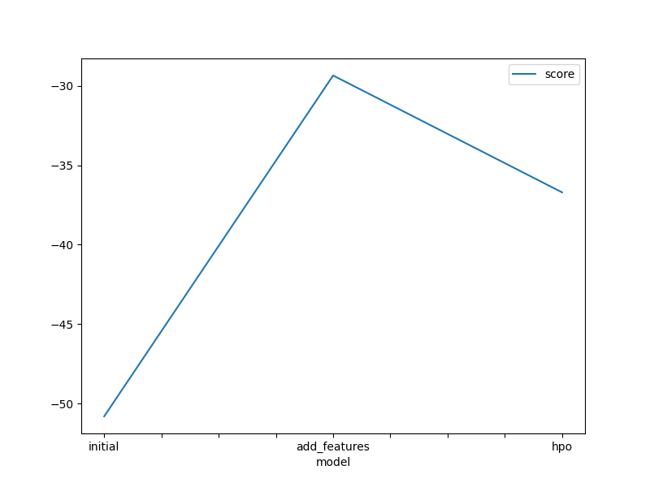
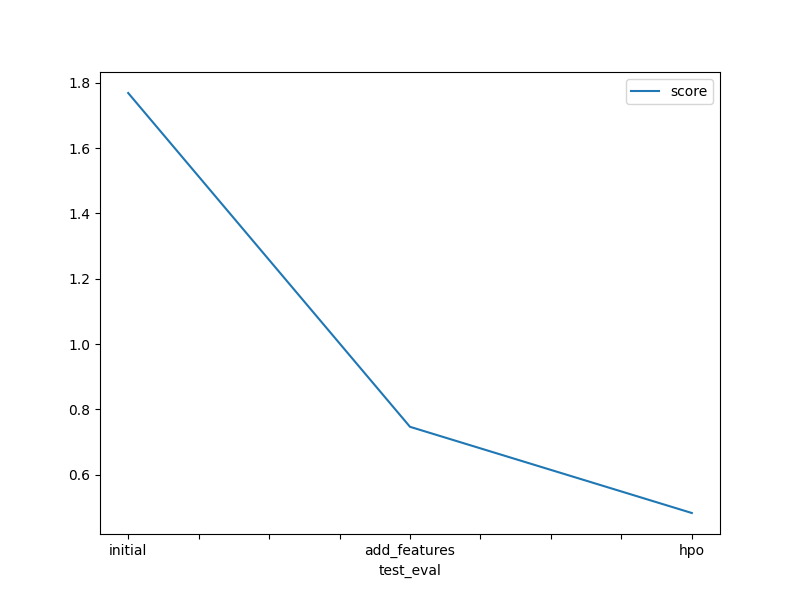

# Report: Predict Bike Sharing Demand with AutoGluon Solution

#### Astom Ahashie

## Initial Training

### What did you realize when you tried to submit your predictions? What changes were needed to the output of the predictor to submit your results?

I had to check for any negative numbers and replace them with zeros.
This is because Kaggle would reject the submission if the values were negative.
In my case there wer two negative numbers which were subtituted with zeros.

### What was the top ranked model that performed?

The top ranked model was WeightedEnsemble_L3, which has a score_val of -50.809726.

## Exploratory data analysis and feature creation

### What did the exploratory analysis find and how did you add additional features?

It was observed that the `season` and `weather` features were categorical features and not integers.

I decomposed the datetime field into `year`, `month`, `day`, `hour`, `minute`, `second`, creating them as separate columns.
I also converted the `season` and `weather` features into categories.

### How much better did your model preform after adding additional features and why do you think that is?

The model outperformed the initial model by 57.44%, from 1.77744 to 0.75644.
This is because the new features empower AutoGluon to increase the number of algorithms which were used for training the model.

## Hyper parameter tuning

### How much better did your model preform after trying different hyper parameters?

The model outperformed the new features-only model by 33.73% and the initial model by 71.80%.
The hyper parameter tuning model received a score of 0.50132, the new features model received a score of 0.75644, and the initial model received a score of 1.77744.

### If you were given more time with this dataset, where do you think you would spend more time?

I would spend more time hyper parameter tuning, experimenting with different eval metrics, time_limit, num_trials and the others.

### Create a table with the models you ran, the hyperparameters modified, and the kaggle score.

| model        | num_bag_folds | num_bag_sets | num_stack_levels | score   |
| ------------ | ------------- | ------------ | ---------------- | ------- |
| initial      | 0             | 1            | 0                | 1.77744 |
| add_features | 0             | 1            | 0                | 0.75644 |
| hpo          | 5             | 1            | 1                | 0.50132 |

### Create a line plot showing the top model score for the three (or more) training runs during the project.

### Create a line plot showing the top kaggle score for the three (or more) prediction submissions during the project.

## Summary

This project shows that feature engineering and hyperparameter tuning can improves the performance of the model dramatically.
